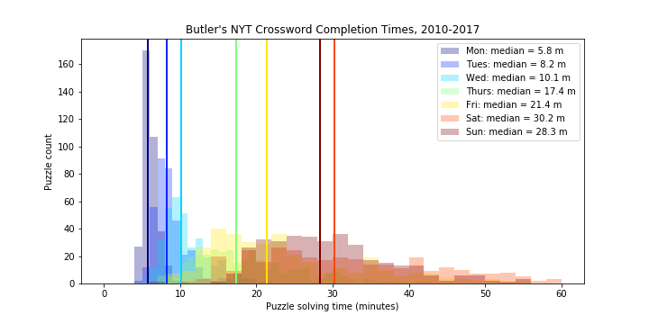

# Recreating Roy Leban's Analysis of NY Times Crossword Puzzle Difficulty by Day of the Week

A short, just-for-fun web scraping exercise to recreate an analysis of New York Times crossword difficulty from Bill Butler's crossword solutions web site.
